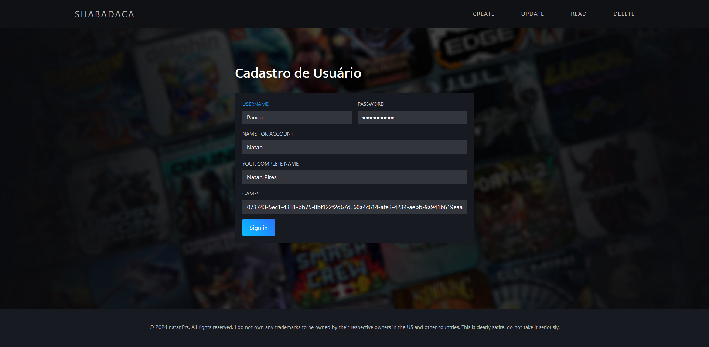

# NextStage


> Este projeto tem como objetivo o desenvolvimento do back-end de uma plataforma de jogos. A plataforma permite aos usuários exibir os jogos que já jogaram e seus favoritos. Além disso, os usuários podem avaliar, comentar e participar de discussões sobre os jogos. É um espaço pensado para compartilhar experiências e opiniões, criando uma comunidade engajada em torno do universo dos games.

> Pensado para os amantes dos Games, de Gamer para Gamers.

<div align="center">
  
</div>

### Ajustes e melhorias

O projeto ainda está em desenvolvimento e as próximas atualizações serão voltadas para as seguintes tarefas:

- [x] Armazenar as informações em um banco de dados relacional
- [x] Criar uma interface (Front-end) simples
- [x] Recuperar as informações do front-end 
- [x] Autenticação e login (Back-end)
- [ ] Autenticação e login (Front-end)
- [ ] Pagina inicial
- [ ] Deixar tudo mais elegante


## 💻 Pré-requisitos

Antes de começar, verifique se você atendeu aos seguintes requisitos:

- Você instalou a versão mais recente de `<Java / dependências disponíveis em: pom.xml>`
- Você tem uma máquina `<Windows>`
- Você leu `<documentação_relacionada_ao_projeto>`

## 🚀 Instalando <NextStage>

Para instalar o <NextStage>, siga estas etapas:

Clone o repositório 
```
git https://github.com/natanPrs/NextStage.git
```

## 🤝 Colaboradores

Agradecemos às seguintes pessoas que contribuíram para este projeto:

<table>
  <tr>
    <td align="center">
      <a href="https://github.com/natanPrs" title="natanPrs">
        <br>
        <sub>
          <b>Natan Pires</b>
        </sub>
      </a>
    </td>

</table>

## 😄 Isso é tudo

Este é um projeto com fins acadêmicos, mas, caso queira utilizá-lo de alguma maneira, sinta-se à vontade.